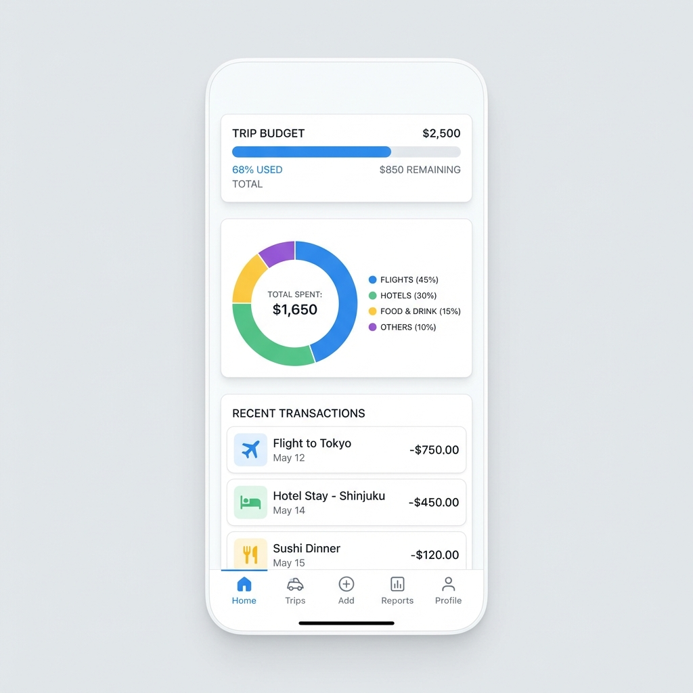

# Travel Expense Tracker ✈️💰

A modern, offline-first web application designed for travelers to track expenses across different trips, currencies, and timezones.

## Core Features

- **Multi-Trip Management**: Create and switch between multiple trips (e.g., "Kyoto 2026", "Paris Business").
- **Smart Currency Handling**:
  - Set **Home Currency** (e.g., HKD) and **Default Foreign Currency** (e.g., JPY).
  - **Auto-Rate Logic**: Automatically sets exchange rate to `1` when paying in your home currency.
  - **Smart Sub-totals**: Daily summaries separate cash usage by currency (HKD cash vs JPY cash) so you always know how much physical cash you have left.
- **Advanced Travel Accounting**:
  - **Cost Spreading**: Option to average accommodation costs over the duration of your stay (Check-in to Check-out) for accurate daily spending charts.
  - **IC Card Support**: Specialized payment method for IC Cards (Suica, Pasmo) with a "Card Owner" field.
- **Enhanced Organization**:
  - **Group by Day**: Waterfall view of expenses organized by trip day (Day 1, Day 2...).
  - **Timezone Awareness**: Trip-specific timezone setting to ensure "Daily" charts align with your physical location, not UTC.
  - **Notes Field**: Record extra details like "Purchase Date" or "Deposit paid" without cluttering the main timeline.
- **Visual Analytics**: Dynamic doughnut charts for category breakdown and bar charts for daily spending trends.
- **Data Sovereignty**:
  - 100% Client-side. All data stays in your browser's `localStorage`.
  - **Export/Import**: Full JSON backups and CSV export for Excel/Google Sheets.

## Tech Stack

- **UI**: HTML5, Vanilla CSS, [Tailwind CSS](https://tailwindcss.com/) (JIT).
- **Icons**: [Lucide Icons](https://lucide.dev/).
- **Charts**: [Chart.js](https://www.chartjs.org/).
- **Engine**: Pure Vanilla JavaScript (ES6+).

## Usage

1. Simply open `index.html` in any modern web browser.
2. Go to **Settings** to set your budget, trip dates, and preferred currencies.
3. Start adding expenses via the **+** button!

---
*Developed with focus on privacy, speed, and traveler UX.*
