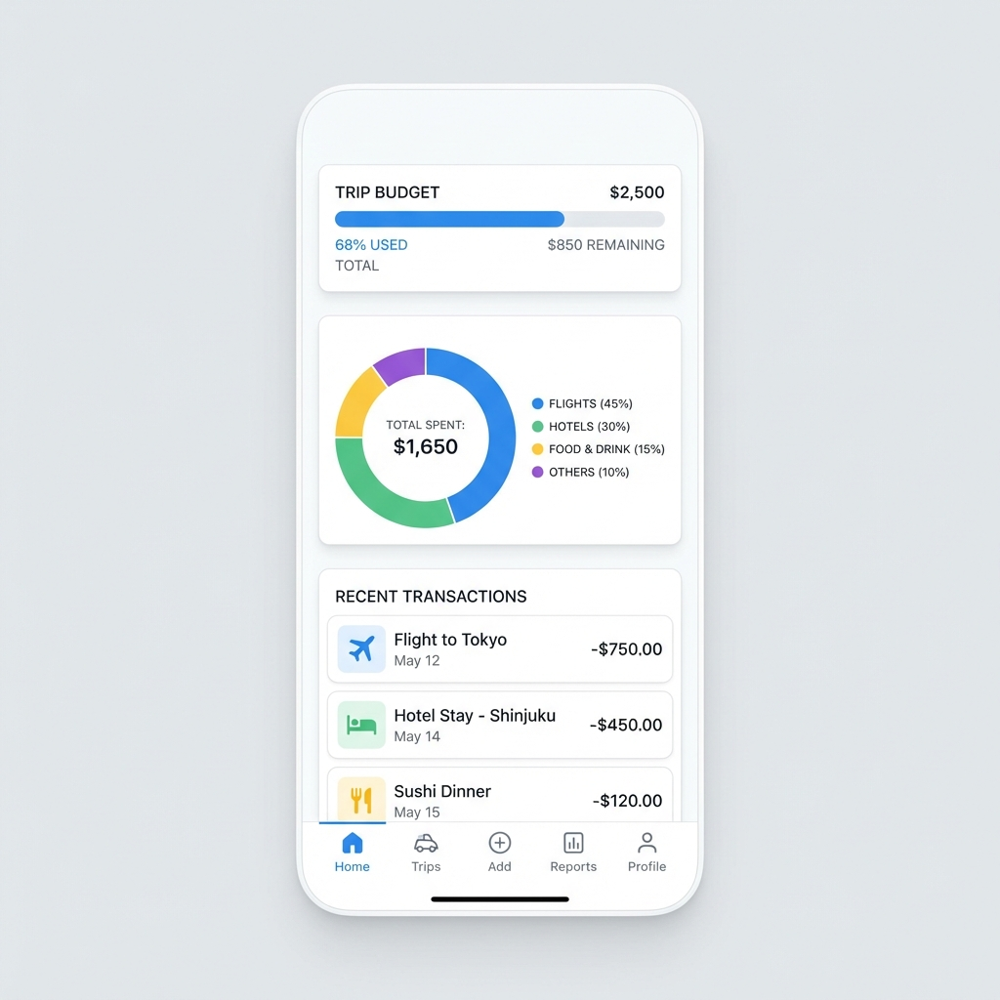

# Travel Expense Tracker ✈️💰

A modern, offline-first web app for travellers to track expenses across trips, currencies, and timezones. **Hong Kong Chinese (zh-HK)** UI with dark mode support.

## Core Features

- **Multi-Trip Management**: Create, switch, and delete trips (e.g. "Kyoto 2026", "Paris Business"). Tap the header to change trip; delete from the trip list when more than one trip exists.
- **Smart Currency Handling**:
  - Set **Home Currency** (e.g. HKD) and **Default Foreign Currency** (e.g. JPY).
  - **Auto-Rate Logic**: Exchange rate auto-sets to `1` when paying in home currency.
  - **Per-Currency Breakdown**: Dashboard shows spending by currency (JPY, HKD, etc.) with native amounts and home-currency equivalents.
  - **Smart Sub-totals**: Daily summaries separate cash by currency (HKD cash vs JPY cash) so you know how much physical cash is left.
- **Payment Methods**:
  - **現金** (Cash), **IC卡**, **碌卡** (Card), **電子付款** (E-pay), **代付** (Paid by others).
  - IC / E-pay / 代付 support an optional owner/account field.
- **Advanced Travel Accounting**:
  - **Cost Spreading**: Option to average accommodation cost over the stay (check-in to check-out) for accurate daily charts.
  - **Receipts**: Attach one photo per expense (camera or choose from gallery on mobile). View in lightbox from the list.
- **Quick Add & Presets**:
  - **FAB long-press**: Quick templates (早餐、午餐、晚餐、飲品、超市、手信、地鐵、巴士、的士、Uber).
  - **Title presets** in the add/edit modal change by category: 一般 (e.g. 早餐、手信、門票、藥房、貼士), 交通 (e.g. 地鐵/MTR、巴士、的士、機票、泊車費), 住宿 (e.g. 酒店、民宿、Airbnb).
- **Enhanced Organisation**:
  - **Group by Day**: Waterfall view by trip day (Day 1, Day 2…).
  - **Search**: Filter expenses by title, note, category, currency, address, flight, etc. in the list view.
  - **Category & Payment Filters**: Filter by 一般/住宿/交通 and by payment method.
  - **Sort**: Date (新→舊 / 舊→新) or amount (高→低 / 低→高).
  - **Duplicate Expense**: One-tap copy of any expense with a new timestamp; receipt is not copied.
  - **Undo Delete**: Deleted items can be restored within a few seconds via the toast.
  - **Timezone Awareness**: Trip-specific timezone so daily charts match your location.
  - **Notes Field**: Per-expense notes without cluttering the timeline.
- **General Note (Trip-level)**:
  - One **Markdown**-supported note per trip for plans, reminders, or day-by-day memos (e.g. AI itineraries).
  - Edit in **Settings**; auto-resizing textarea and **Preview** toggle for rendered Markdown.
  - On **Dashboard** when set: collapsible block, copy to clipboard, and link to edit.
- **Visual Analytics**: Doughnut chart for category breakdown, bar chart for daily spending; **Statistics summary** (筆數、日均、最高單筆).
- **Sharing**: Share a single expense or trip summary (Web Share API or copy to clipboard).
- **Data Sovereignty**:
  - 100% client-side. Data in browser **localStorage** (receipt images in **IndexedDB**).
  - **Export/Import**: Full JSON backup and CSV export for Excel/Google Sheets.
- **Dark Mode**: Toggle in Settings; all views, modals, and cards support dark theme.
- **PWA Ready**: Install as a standalone app; works offline with automatic data persistence.

## Tech Stack

- **UI**: HTML5, [Tailwind CSS](https://tailwindcss.com/) (JIT, `darkMode: 'class'`).
- **Icons**: [Lucide Icons](https://lucide.dev/).
- **Charts**: [Chart.js](https://www.chartjs.org/).
- **Markdown**: [marked](https://marked.js.org/) + [DOMPurify](https://github.com/cure53/DOMPurify) for safe trip notes.
- **Engine**: Vanilla JavaScript (ES6+ modules).

## Usage

1. Open `index.html` in a modern browser (or install as PWA).
2. In **Settings**, set budget, trip dates, currencies, timezone (e.g. 香港/台灣/北京), and optional **General Note** (Markdown). Enable **深色模式** if desired.
3. Add expenses with **+** (tap = new entry, long-press = quick templates). Use **Title presets** under the title field; attach a receipt and **Duplicate** for recurring items.
4. In the list view, use **Search**, category/payment filters, and **Sort**. Group by day via the toggle. Use the header to switch or delete trips.

---

_Built for privacy, speed, and traveller UX. UI in 香港中文 (zh-HK)._
